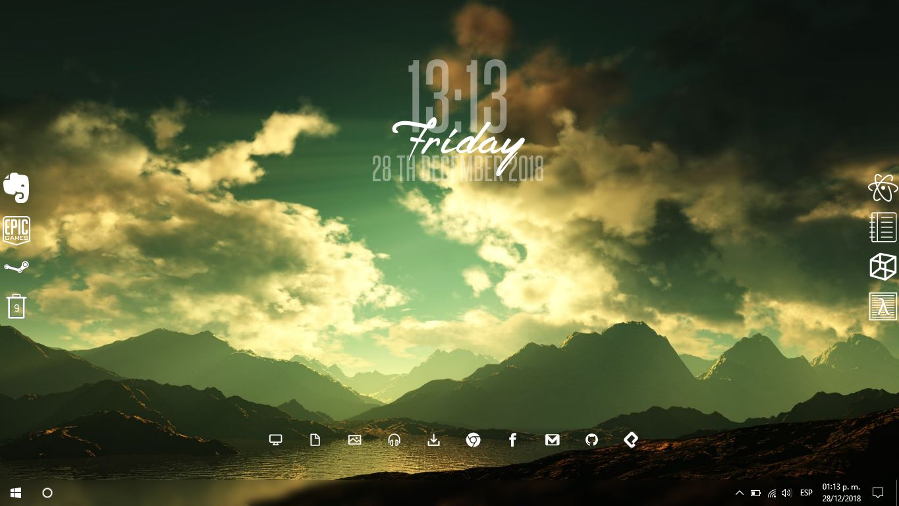

# Icons Rainmeter unFold
In this repository you will able to find different icons of the type "unFold" for Rainmeter.
## What are the unFold skins? :computer:
The unFold skins are buttons that can be added in your desktop to use them as shortcuts.
They have very nice designs and you can add them in the right/left of your desktop.
##### You can have something like this.

Where the unFold buttons are:

## Pre-requirements :clipboard:
Things you need to use this skins on your desktop.
---
* Have the last version of Rainmeter (this project was developed in version 4.2.0) installed in you PC.
* Have the others unFold buttons (if you don't have them, you can download them [here](https://www.deviantart.com/devilrev/art/unFold-A-Launcher-618503449)).
* Enough space on your disk to clone or download the skins.
* Know the path where the skins of Rainmeter are located.
---
## Installation :wrench:
Next, the steps you need to follow in order to install any button of here are:
---
1. Clone or download this project.
2. Select the folder of the button you want to add on your desktop.
3. Paste the folder in the Skins of Rainmeter in the folder "unFold" (if you still don't have the others unFold buttons you can download them [here](https://www.deviantart.com/devilrev/art/unFold-A-Launcher-618503449)).
4. Enter into the folder of the button and select the type of button you want.
5. Depending on the type of button (Black, Transparent or White), you need to copy the image and paste it into the folder "@Resources/Buttons".
6. Now, just open Rainmeter, search unFold and load the button you want, you can change the position of it but this kind of buttons are always in the border right or left of the dektop.
---
## Authors and Credits
* The original idea of the unFold skins is of **DevilRev**.
* The buttons on this repository were developed by me, [Ruben35](https://github.com/Ruben35).
## License :page_with_curl:
All the content of this project is under the GNU General Public License v2.0 - look the [LICENSE](https://github.com/Ruben35/Icons-unFold-Rainmeter/blob/master/LICENSE) file for more details.
